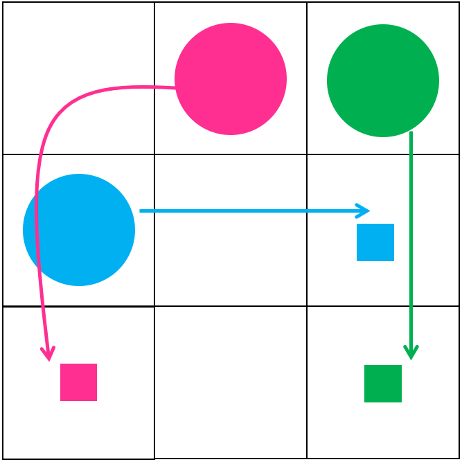
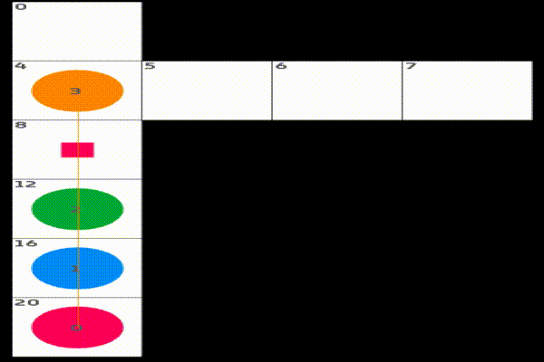

<div align="center">



# mapf-visualizer

[](LICENSE)
[](https://github.com/Kei18/mapf-visualizer/actions/workflows/ci.yml)

Simple multi-agent pathfinding (MAPF) visualizer for research usage.

Based on [openFrameworks](https://openframeworks.cc/), written in C++, developed for macOS, untested on Linux.

</div>

## Demo




## Install

```sh
git clone --recursive git@github.com:Kei18/mapf-visualizer.git
cd mapf-visualizer
bash third_party/openFrameworks/scripts/osx/download_libs.sh
make
echo "export PATH=$(pwd)/bin/mapf-visualizer.app/Contents/MacOS:\$PATH" >> ~/.bashrc
```

required: around 10 minutes

## Usage

```sh
mapf-visualizer assets/random-32-32-20.map assets/demo_random-32-32-20.txt
```

You can manipulate it via your keyboard. See printed info.

## Input format of planning result

e.g.,
```txt
0:(5,16),(21,29),[...]
1:(5,17),(21,28),[...]
[...]
```

`(x, y)` denotes location.
`(0, 0)` is the left-top point.
`(x, 0)` is the location at `x`-th column and 1st row.

## Notes

- Please specify **correct** files. I omitted error handling
- The grid maps in `assets/` are from [MAPF benchmarks](https://movingai.com/benchmarks/mapf.html)
- The font in `visualizer/bin/data` is from [Google Fonts](https://fonts.google.com/)
- This repo is forked from a series of my previous studies such as [pibt2](https://kei18.github.io/pibt2), [mapf-IR](https://kei18.github.io/mapf-IR/), [tswap](https://kei18.github.io/tswap/), [otimapp](https://kei18.github.io/otimapp/), etc
- Auto formatting (clang-format) when committing:
```export
git config core.hooksPath .githooks && chmod a+x .githooks/pre-commit
```
- I'm happy if this repo helps somebody. Please use "Cite this repository" on this page for citation.

## Licence

This software is released under the MIT License, see [LICENSE.txt](LICENCE.txt).

## Author

[Keisuke Okumura](https://kei18.github.io) is a Ph.D. student at Tokyo Institute of Technology, interested in controlling multiple moving agents.
